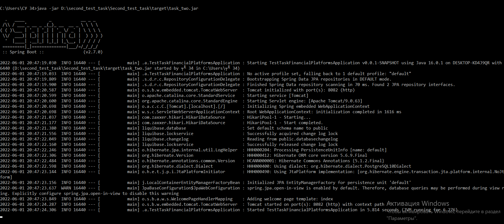

### Задача2

Имеется embedded реляционная база данных (любая sql embedded БД). Завести в БД таблицу данных о студентах, которая будет содержать: имя, фамилия, отчество, дата рождения, номер группы, уникальный номер. Реализовать консольный или графический интерфейс, с помощью которого можно: добавить студента, удалить студента по уникальному номеру, вывести список студентов.

### Требования к выполненным заданиям 

* Версия java любая любая из трёх: 8, 11, 17;
* Приложение не должно требовать для работы предварительного ручного выполнения sql скриптов, таблицы должны автомаически создаваться при запуске приложения;
* После сборки проекта приложение должно быть готово для запуска одной командой.

